# Detailed Software Design Document

## 1. 문서 개요

### 1.1 목적 및 범위

본 문서는 cosMall 화장품 쇼핑몰 프로젝트의 상세 설계 문서입니다. 이 문서는 다음과 같은 내용을 포함합니다:

- 시스템 아키텍처 상세 설계
- 주요 컴포넌트 설계
- 데이터베이스 설계
- API 인터페이스 명세
- UI 컴포넌트 설계
- 보안 및 성능 최적화 전략

### 1.2 용어 정의 및 약어

| 용어 | 설명 |
|------|------|
| JWT | JSON Web Token, 사용자 인증을 위한 토큰 기반 인증 방식 |
| DDD | Domain Driven Design, 도메인 주도 설계 |
| REST | Representational State Transfer, HTTP 기반의 아키텍처 스타일 |
| JPA | Java Persistence API, 자바 ORM 표준 |
| CORS | Cross-Origin Resource Sharing, 교차 출처 리소스 공유 |
| XSS | Cross-Site Scripting, 크로스 사이트 스크립팅 공격 |
| CSRF | Cross-Site Request Forgery, 크로스 사이트 요청 위조 |

### 1.3 참조 문서

- Spring Boot 공식 문서 (https://docs.spring.io/spring-boot/docs/current/reference/html/)
- Spring Security 공식 문서 (https://docs.spring.io/spring-security/reference/)
- JPA 공식 문서 (https://docs.spring.io/spring-data/jpa/docs/current/reference/html/)
- React 공식 문서 (https://react.dev/docs/getting-started.html)
- Iamport 결제 연동 가이드 (https://docs.iamport.kr/)

## 2. 시스템 아키텍처 상세

### 2.1 레이어드 아키텍처 다이어그램

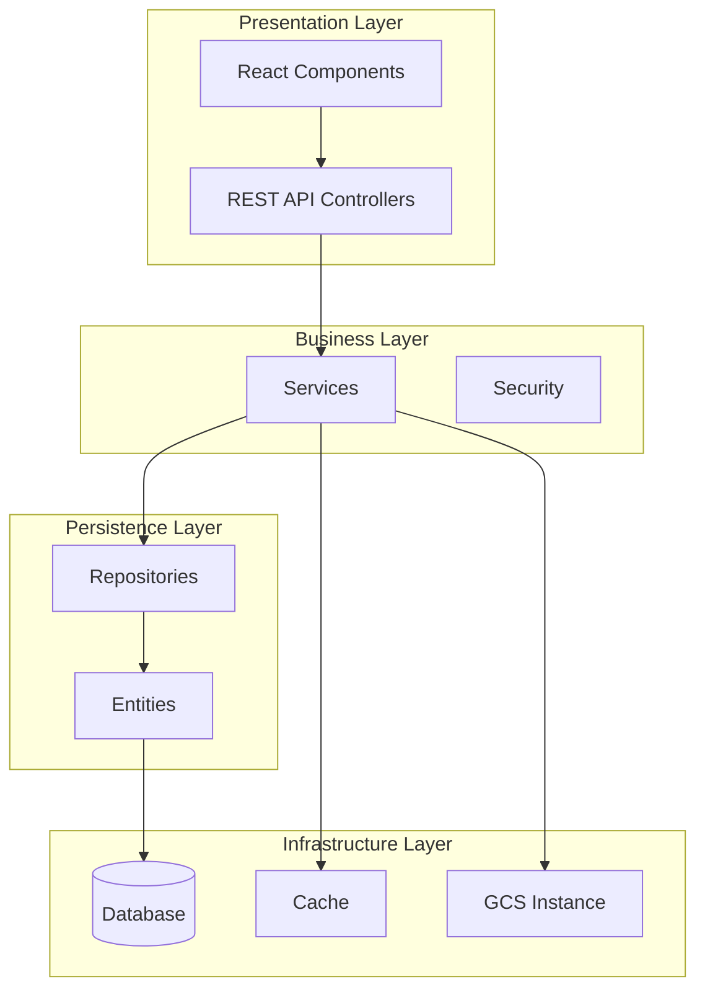

### 2.2 컴포넌트 간 인터페이스 정의

#### 2.2.1 Presentation Layer
- **Controller**: REST API 엔드포인트 제공
- **DTO**: 데이터 전송 객체 정의
- **Validator**: 입력 데이터 검증

#### 2.2.2 Business Layer
- **Service**: 비즈니스 로직 처리
- **Security**: 인증/인가 처리
- **Exception Handler**: 예외 처리

#### 2.2.3 Persistence Layer
- **Repository**: 데이터 접근 인터페이스
- **Entity**: 도메인 모델
- **Mapper**: Entity-DTO 변환

### 2.3 패키지 구조 및 의존성

```
cosmeticShop/
├── src/main/java/Midas/cosmeticshop/
│   ├── config/           # 설정 클래스
│   ├── controller/       # REST API 컨트롤러
│   ├── dto/             # 데이터 전송 객체
│   ├── entity/          # 도메인 모델
│   ├── repository/      # 데이터 접근 계층
│   ├── service/         # 비즈니스 로직
│   ├── security/        # 보안 관련 클래스
│   └── util/            # 유틸리티 클래스
└── src/main/resources/
    ├── application.yml  # 애플리케이션 설정
    └── static/          # 정적 리소스 
```

## 3. 컴포넌트 설계

### 3.1 인증·인가 모듈

#### 3.1.1 AuthController, CustomAuthenticationProvider 클래스 상세

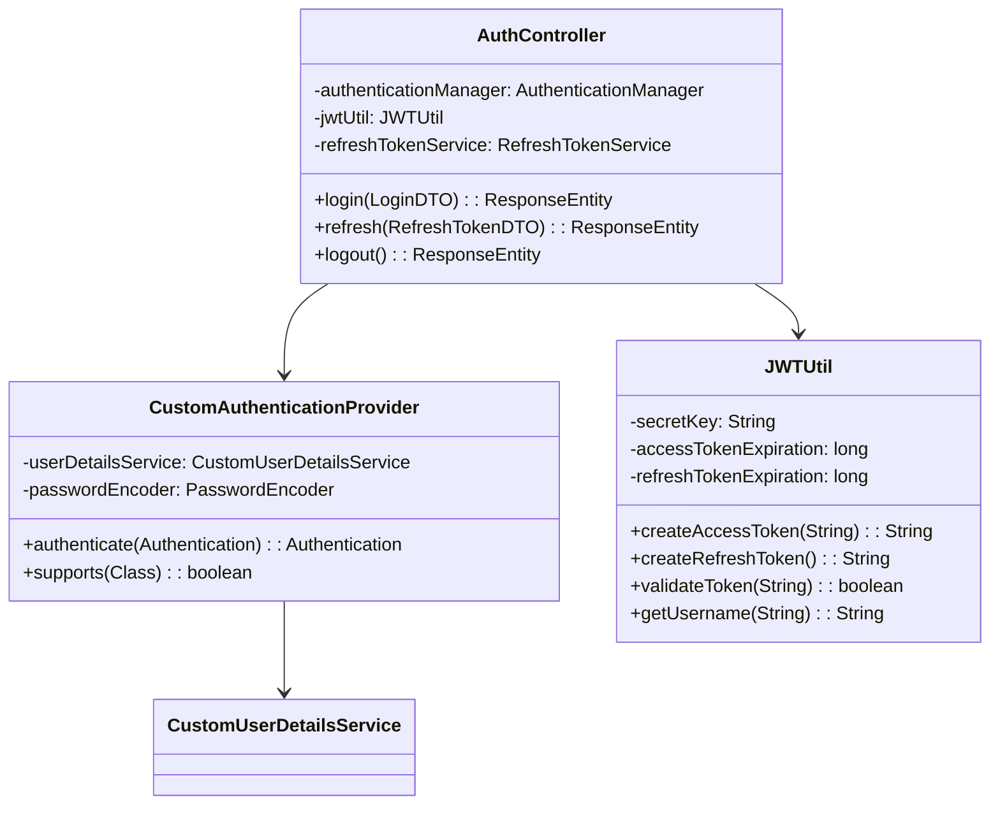

#### 3.1.2 JWT 발급/검증 흐름

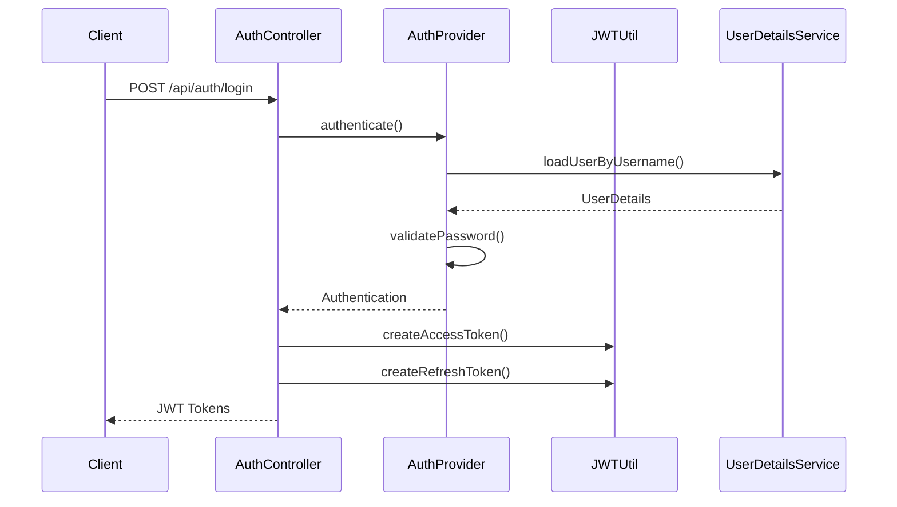

#### 3.1.3 예외 처리 전략 및 에러 코드 매핑

| 에러 코드 | HTTP 상태 | 설명 |
|-----------|-----------|------|
| AUTH001 | 401 | 인증 실패 |
| AUTH002 | 401 | 토큰 만료 |
| AUTH003 | 403 | 권한 없음 |
| AUTH004 | 400 | 잘못된 토큰 |

### 3.2 사용자 관리(User Service) 모듈

#### 3.2.1 BaseUserService, UserRepository 인터페이스 설계

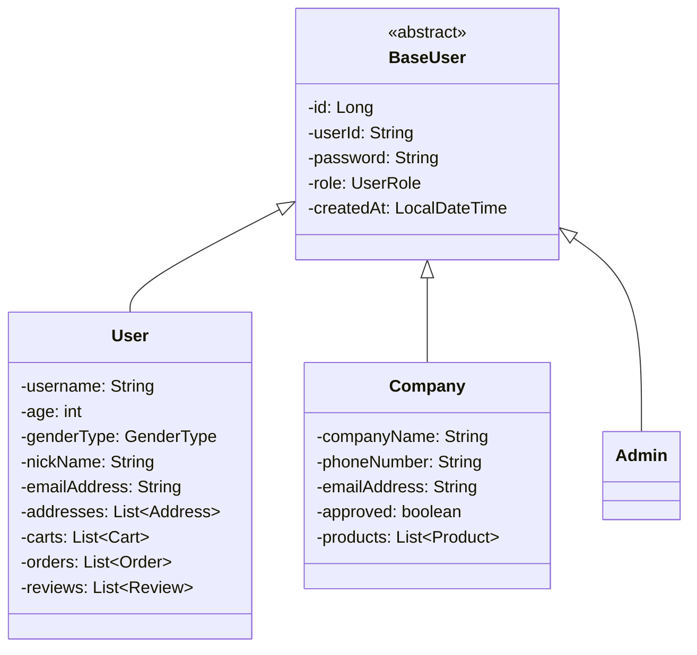

#### 3.2.2 DTO와 Entity 매핑 구조

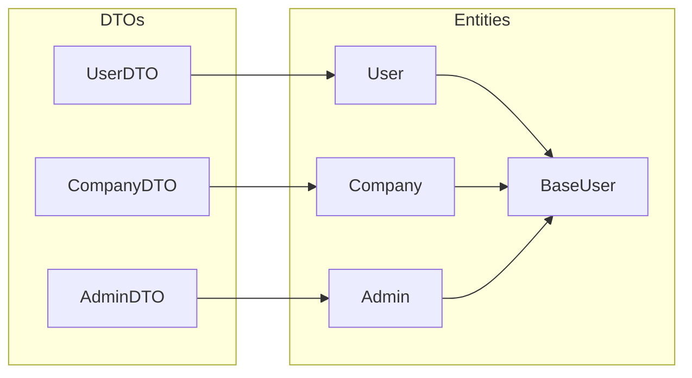

### 3.3 상품 관리(Product Service) 모듈

#### 3.3.1 ProductController, ProductService 클래스 다이어그램

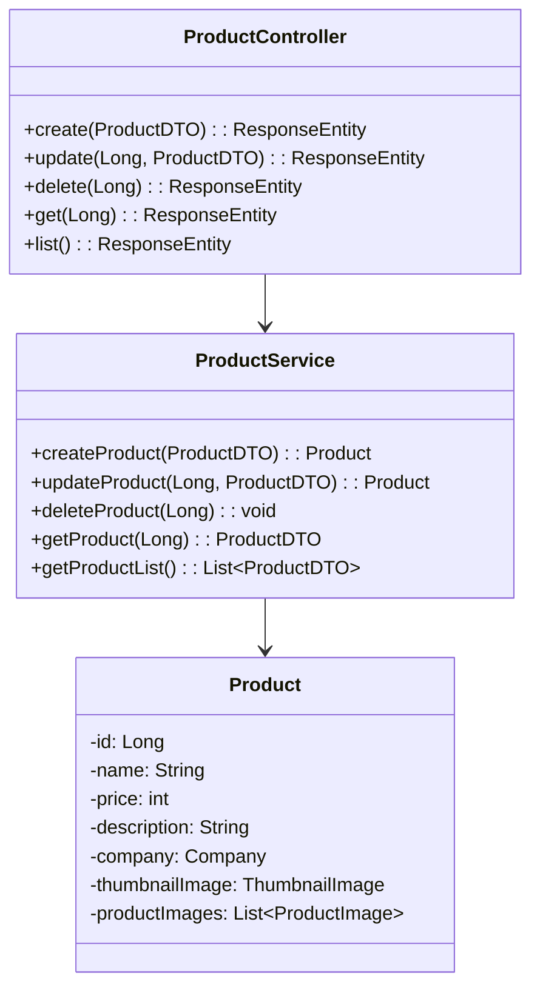

#### 3.3.2 옵션/이미지 처리 로직 상세

- 이미지 업로드: Google Cloud Storage Instance 사용
- 썸네일 자동 생성
- 다중 이미지 처리
- 이미지 최적화 (리사이징, 압축)

### 3.4 주문·결제(Order & Payment) 모듈

#### 3.4.1 OrderService, PaymentService 인터페이스 정의

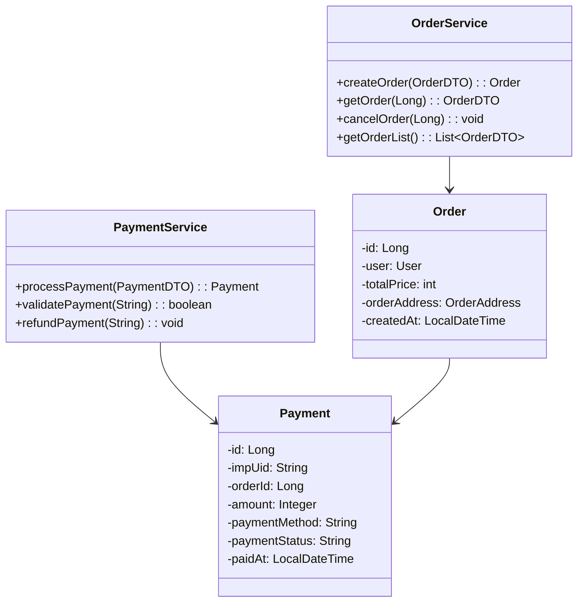

#### 3.4.2 Iamport 연동 흐름

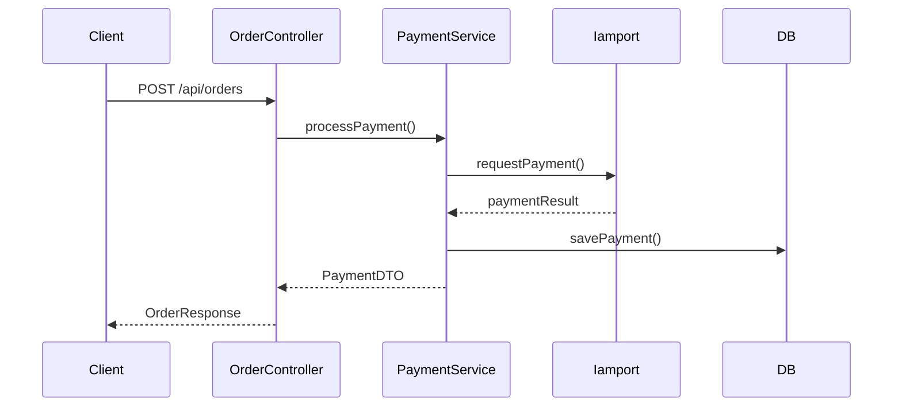

### 3.5 리뷰·QnA·쿠폰·관리자 모듈 설계

#### 3.5.1 리뷰 모듈

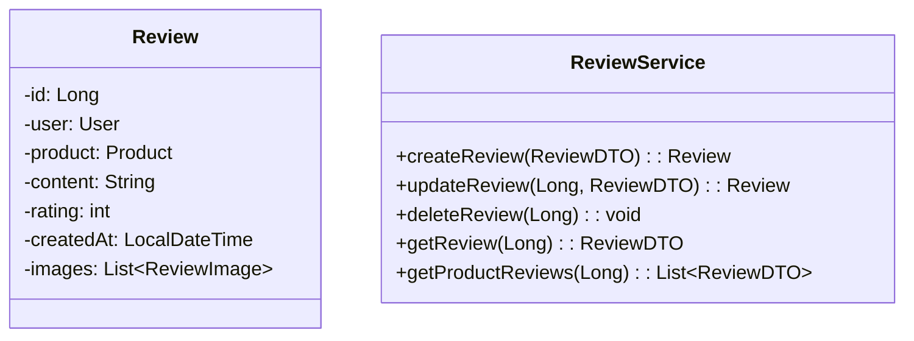

#### 3.5.2 QnA 모듈

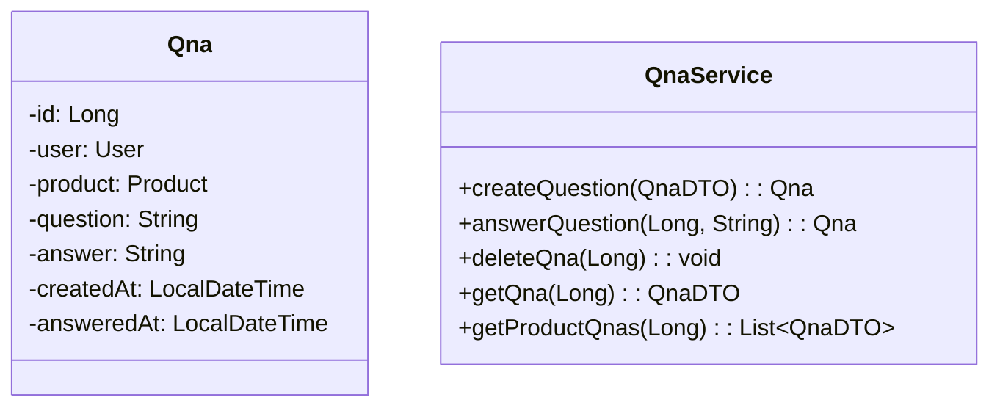

#### 3.5.3 쿠폰 모듈

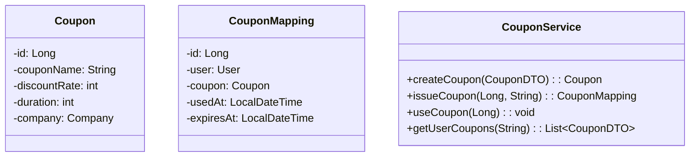

## 4. 클래스 및 인터페이스 다이어그램

### 4.1 주요 도메인 클래스 구조

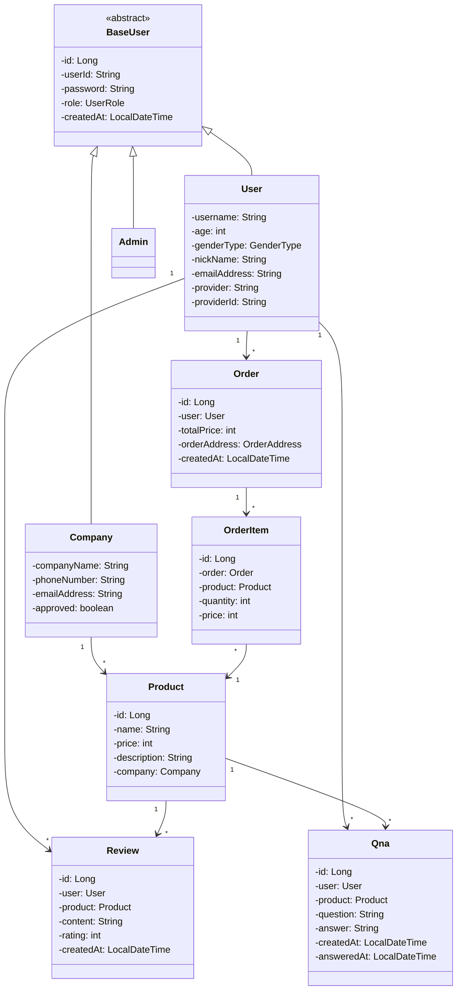

### 4.2 Service 계층 클래스 다이어그램

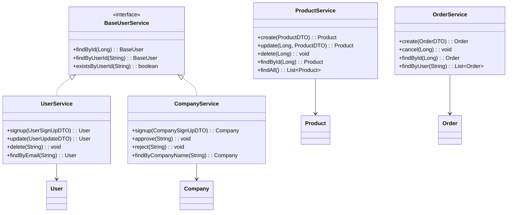

### 4.3 Repository 계층 및 JPA 매핑

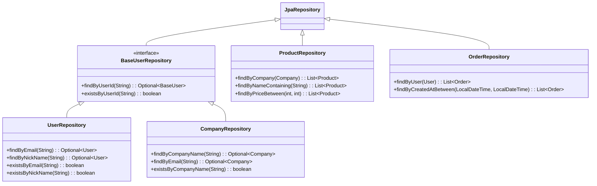

## 5. 데이터베이스 상세 설계

### 5.1 테이블 DDL 및 INDEX 정의

```sql
-- 기본 사용자 테이블
CREATE TABLE base_user (
    id BIGINT AUTO_INCREMENT PRIMARY KEY,
    user_id VARCHAR(50) NOT NULL UNIQUE,
    password VARCHAR(100) NOT NULL,
    role VARCHAR(20) NOT NULL,
    created_at TIMESTAMP NOT NULL,
    INDEX idx_user_id (user_id)
);

-- 일반 사용자 테이블
CREATE TABLE users (
    id BIGINT PRIMARY KEY,
    username VARCHAR(50) NOT NULL,
    age INT NOT NULL,
    gender VARCHAR(10) NOT NULL,
    nickname VARCHAR(50) NOT NULL UNIQUE,
    email VARCHAR(100) UNIQUE,
    provider VARCHAR(20),
    provider_id VARCHAR(255),
    FOREIGN KEY (id) REFERENCES base_user(id),
    INDEX idx_email (email),
    INDEX idx_nickname (nickname)
);

-- 기업 사용자 테이블
CREATE TABLE companies (
    id BIGINT PRIMARY KEY,
    company_name VARCHAR(100) NOT NULL UNIQUE,
    phone VARCHAR(20),
    email VARCHAR(100) NOT NULL UNIQUE,
    approved BOOLEAN DEFAULT FALSE,
    FOREIGN KEY (id) REFERENCES base_user(id),
    INDEX idx_company_name (company_name)
);

-- 상품 테이블
CREATE TABLE products (
    id BIGINT AUTO_INCREMENT PRIMARY KEY,
    name VARCHAR(100) NOT NULL,
    price INT NOT NULL,
    description TEXT,
    company_id BIGINT NOT NULL,
    FOREIGN KEY (company_id) REFERENCES companies(id),
    INDEX idx_name (name),
    INDEX idx_price (price)
);

-- 주문 테이블
CREATE TABLE orders (
    id BIGINT AUTO_INCREMENT PRIMARY KEY,
    user_id BIGINT NOT NULL,
    total_price INT NOT NULL,
    address_city VARCHAR(50) NOT NULL,
    address_street VARCHAR(100) NOT NULL,
    address_detail VARCHAR(100) NOT NULL,
    created_at TIMESTAMP NOT NULL,
    FOREIGN KEY (user_id) REFERENCES users(id),
    INDEX idx_user_created (user_id, created_at)
);

-- 주문 상세 테이블
CREATE TABLE order_items (
    id BIGINT AUTO_INCREMENT PRIMARY KEY,
    order_id BIGINT NOT NULL,
    product_id BIGINT NOT NULL,
    quantity INT NOT NULL,
    price INT NOT NULL,
    FOREIGN KEY (order_id) REFERENCES orders(id),
    FOREIGN KEY (product_id) REFERENCES products(id),
    INDEX idx_order (order_id)
);

-- 리뷰 테이블
CREATE TABLE reviews (
    id BIGINT AUTO_INCREMENT PRIMARY KEY,
    user_id BIGINT NOT NULL,
    product_id BIGINT NOT NULL,
    content TEXT NOT NULL,
    rating INT NOT NULL,
    created_at TIMESTAMP NOT NULL,
    FOREIGN KEY (user_id) REFERENCES users(id),
    FOREIGN KEY (product_id) REFERENCES products(id),
    INDEX idx_product_created (product_id, created_at)
);

-- QnA 테이블
CREATE TABLE qnas (
    id BIGINT AUTO_INCREMENT PRIMARY KEY,
    user_id BIGINT NOT NULL,
    product_id BIGINT NOT NULL,
    question TEXT NOT NULL,
    answer TEXT,
    created_at TIMESTAMP NOT NULL,
    answered_at TIMESTAMP,
    FOREIGN KEY (user_id) REFERENCES users(id),
    FOREIGN KEY (product_id) REFERENCES products(id),
    INDEX idx_product_created (product_id, created_at)
);

-- 쿠폰 테이블
CREATE TABLE coupons (
    id BIGINT AUTO_INCREMENT PRIMARY KEY,
    coupon_name VARCHAR(100) NOT NULL,
    discount_rate INT NOT NULL,
    duration INT NOT NULL,
    company_id BIGINT NOT NULL,
    FOREIGN KEY (company_id) REFERENCES companies(id)
);

-- 쿠폰 매핑 테이블
CREATE TABLE coupon_mappings (
    id BIGINT AUTO_INCREMENT PRIMARY KEY,
    user_id BIGINT NOT NULL,
    coupon_id BIGINT NOT NULL,
    used_at TIMESTAMP,
    expires_at TIMESTAMP NOT NULL,
    FOREIGN KEY (user_id) REFERENCES users(id),
    FOREIGN KEY (coupon_id) REFERENCES coupons(id),
    INDEX idx_user_expires (user_id, expires_at)
);
```

### 5.2 주요 엔티티 속성 설명

| 엔티티 | 속성 | 설명 | 제약조건 |
|--------|------|------|-----------|
| BaseUser | userId | 로그인 ID | NOT NULL, UNIQUE |
| BaseUser | password | 암호화된 비밀번호 | NOT NULL |
| BaseUser | role | 사용자 권한 | NOT NULL |
| User | nickname | 사용자 닉네임 | NOT NULL, UNIQUE |
| User | email | 이메일 주소 | UNIQUE |
| Company | companyName | 기업명 | NOT NULL, UNIQUE |
| Company | approved | 승인 여부 | DEFAULT FALSE |
| Product | name | 상품명 | NOT NULL |
| Product | price | 가격 | NOT NULL |
| Order | totalPrice | 총 주문금액 | NOT NULL |
| Review | rating | 평점 | NOT NULL, 1-5 |
| Coupon | discountRate | 할인율 | NOT NULL, 0-100 |

### 5.3 관계 매핑(FK, Join Table)

- User - Order: 1:N (user_id FK)
- Order - OrderItem: 1:N (order_id FK)
- OrderItem - Product: N:1 (product_id FK)
- Product - Company: N:1 (company_id FK)
- User - Review: 1:N (user_id FK)
- Product - Review: 1:N (product_id FK)
- User - Qna: 1:N (user_id FK)
- Product - Qna: 1:N (product_id FK)
- User - CouponMapping - Coupon: N:M (중간 테이블)

### 5.4 트랜잭션 격리 및 잠금 전략

#### 5.4.1 트랜잭션 격리 수준

- 기본 격리 수준: READ COMMITTED
- 주문 처리: REPEATABLE READ
- 재고 관리: SERIALIZABLE

#### 5.4.2 잠금 전략

- 낙관적 잠금 (Optimistic Lock)
  - 상품 정보 수정
  - 리뷰 수정
  - 회원 정보 수정

- 비관적 잠금 (Pessimistic Lock)
  - 재고 수량 변경
  - 주문 상태 변경
  - 결제 처리

## 6. API 인터페이스 상세

### 6.1 REST 엔드포인트별 계약서

#### 6.1.1 인증 API

| 엔드포인트 | 메서드 | 설명 | 권한 |
|------------|--------|------|------|
| /api/auth/signup/user | POST | 일반 사용자 회원가입 | PUBLIC |
| /api/auth/signup/company | POST | 기업 회원가입 | PUBLIC |
| /api/auth/login | POST | 로그인 | PUBLIC |
| /api/auth/refresh | POST | 토큰 갱신 | PUBLIC |
| /api/auth/logout | POST | 로그아웃 | USER |

#### 6.1.2 사용자 API

| 엔드포인트 | 메서드 | 설명 | 권한 |
|------------|--------|------|------|
| /api/users/me | GET | 내 정보 조회 | USER |
| /api/users/me | PUT | 내 정보 수정 | USER |
| /api/users/me/password | PUT | 비밀번호 변경 | USER |
| /api/users/me/addresses | GET | 배송지 목록 조회 | USER |
| /api/users/me/addresses | POST | 배송지 추가 | USER |

#### 6.1.3 상품 API

| 엔드포인트 | 메서드 | 설명 | 권한 |
|------------|--------|------|------|
| /api/products | GET | 상품 목록 조회 | PUBLIC |
| /api/products/{id} | GET | 상품 상세 조회 | PUBLIC |
| /api/products | POST | 상품 등록 | COMPANY |
| /api/products/{id} | PUT | 상품 수정 | COMPANY |
| /api/products/{id} | DELETE | 상품 삭제 | COMPANY |

#### 6.1.4 주문 API

| 엔드포인트 | 메서드 | 설명 | 권한 |
|------------|--------|------|------|
| /api/orders | POST | 주문 생성 | USER |
| /api/orders/{id} | GET | 주문 조회 | USER |
| /api/orders | GET | 주문 목록 조회 | USER |
| /api/orders/{id}/cancel | POST | 주문 취소 | USER |

#### 6.1.5 결제 API

| 엔드포인트 | 메서드 | 설명 | 권한 |
|------------|--------|------|------|
| /api/payments/prepare | POST | 결제 준비 | USER |
| /api/payments/complete | POST | 결제 완료 | USER |
| /api/payments/{id}/cancel | POST | 결제 취소 | USER |
| /api/payments/webhook | POST | 결제 웹훅 | PUBLIC |

### 6.2 요청·응답 모델

#### 6.2.1 인증 관련

```json
// 회원가입 요청 (UserSignUpDTO)
{
  "userId": "string",
  "password": "string",
  "username": "string",
  "age": "integer",
  "gender": "string",
  "nickName": "string",
  "email": "string"
}

// 로그인 요청 (LoginDTO)
{
  "userId": "string",
  "password": "string"
}

// 로그인 응답
{
  "accessToken": "string",
  "refreshToken": "string",
  "tokenType": "Bearer"
}
```

#### 6.2.2 상품 관련

```json
// 상품 등록 요청 (ProductDTO)
{
  "name": "string",
  "price": "integer",
  "description": "string",
  "thumbnailImage": "file",
  "productImages": ["file"]
}

// 상품 상세 응답
{
  "id": "long",
  "name": "string",
  "price": "integer",
  "description": "string",
  "company": {
    "id": "long",
    "companyName": "string"
  },
  "thumbnailUrl": "string",
  "imageUrls": ["string"],
  "reviews": [{
    "id": "long",
    "rating": "integer",
    "content": "string",
    "userName": "string",
    "createdAt": "datetime"
  }]
}
```

#### 6.2.3 주문 관련

```json
// 주문 생성 요청 (OrderDTO)
{
  "orderItems": [{
    "productId": "long",
    "quantity": "integer"
  }],
  "address": {
    "city": "string",
    "street": "string",
    "detail": "string"
  },
  "couponId": "long"
}

// 주문 응답
{
  "id": "long",
  "totalPrice": "integer",
  "orderStatus": "string",
  "orderItems": [{
    "productName": "string",
    "quantity": "integer",
    "price": "integer"
  }],
  "address": {
    "city": "string",
    "street": "string",
    "detail": "string"
  },
  "createdAt": "datetime"
}
```

### 6.3 예외 응답 포맷 및 공통 헤더

#### 6.3.1 공통 헤더
```
Authorization: Bearer {accessToken}
Content-Type: application/json
Accept: application/json
```

#### 6.3.2 예외 응답 포맷
```json
{
  "timestamp": "datetime",
  "status": "integer",
  "error": "string",
  "code": "string",
  "message": "string",
  "path": "string"
}
```

## 7. 시퀀스·상호작용 다이어그램

### 7.1 회원가입/로그인 시퀀스

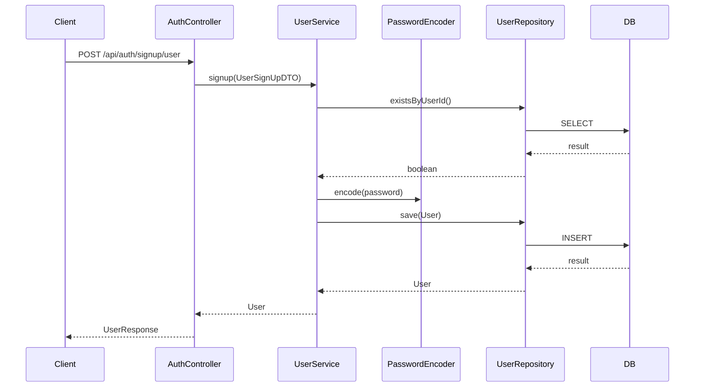

### 7.2 상품 주문 처리 시퀀스

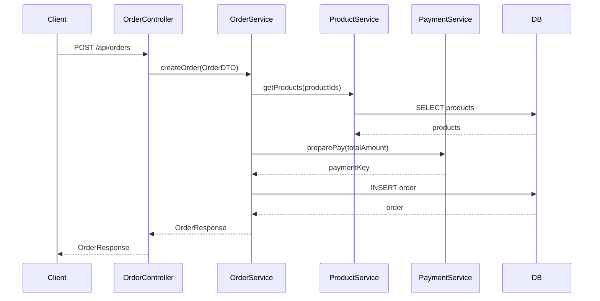

### 7.3 결제 콜백 처리 시퀀스

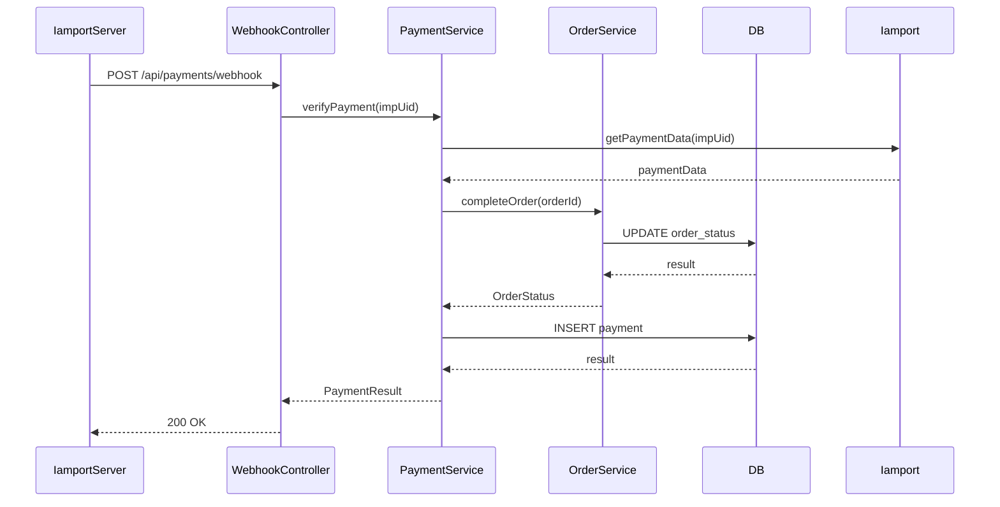

### 7.4 토큰 갱신(Refresh) 시퀀스

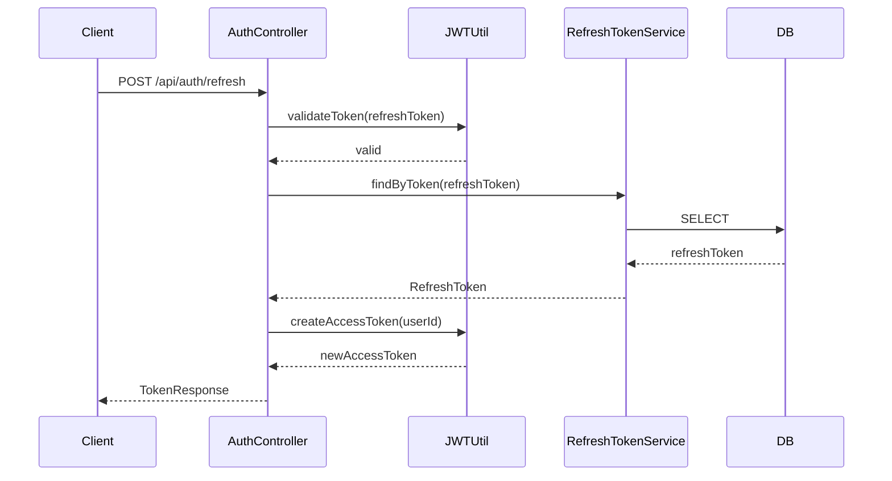

## 8. UI 컴포넌트 설계

### 8.1 주요 화면별 컴포넌트 구조

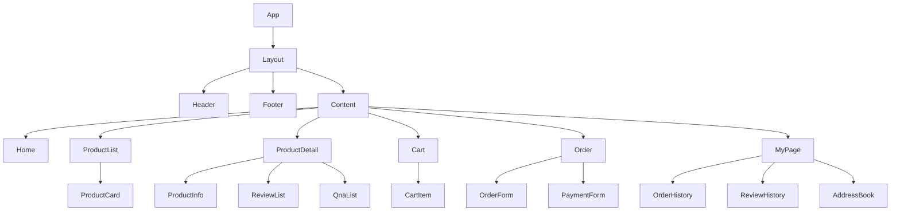

### 8.2 상태 관리 흐름

- Context API 사용
  - AuthContext: 인증 정보 관리
  - CartContext: 장바구니 상태 관리
  - UIContext: 공통 UI 상태 관리

### 8.3 입력 검증 및 공통 UI 패턴

- 입력 검증
  - 클라이언트 측: Yup 스키마 검증
  - 서버 측: Bean Validation

- 공통 UI 패턴
  - 로딩 스피너
  - 에러 메시지
  - 확인 모달
  - 토스트 알림

## 9. 비기능 설계

### 9.1 보안 설계

#### 9.1.1 CSRF/XSS 대응
- CSRF 토큰 사용
- XSS 필터 적용
- 입력값 이스케이프 처리

#### 9.1.2 HTTPS 설정
- SSL/TLS 인증서 적용
- HSTS 헤더 설정
- 보안 헤더 설정

### 9.2 성능 최적화

- 데이터베이스
  - 인덱스 최적화
  - 쿼리 캐싱
  - 커넥션 풀 설정

- 애플리케이션
  - 응답 압축
  - 정적 리소스 캐싱
  - N+1 쿼리 문제 해결

## 10. 부록

### 10.1 UML 다이어그램 모음
- 위의 각 섹션에 포함된 다이어그램 참조

### 10.2 변경 이력
| 버전 | 일자 | 변경 내용 | 작성자 |
|------|------|-----------|--------|
| 1.0 | 2024-03-XX | 최초 작성 | - |

### 10.3 용어집
- 위의 1.2 용어 정의 및 약어 참조